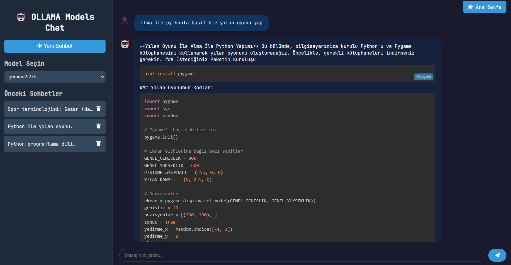

# Django_llama_Chatbot

OLLAMA Models Chat, yapay zeka destekli bir sohbet uygulamasıdır. Bu uygulama, LLAMA 3.1 modeli kullanarak kullanıcıların çeşitli konularda sorular sormasına ve yanıtlar almasına olanak tanır.




## Özellikler

- 🤖 LLAMA 3.1 modeli ile güçlendirilmiş yapay zeka asistanı
- 💻 Kod örnekleri için syntax highlighting
- 📚 Sohbet geçmişi kaydetme ve görüntüleme
- 🔄 Çoklu OLLAMA model desteği
- 👥 Kullanıcı dostu arayüz
- ⚡ Hızlı ve verimli yanıt sistemi

## Teknolojiler

- Backend: Django
- Frontend: HTML, CSS, JavaScript (jQuery)
- AI Model: LLAMA 3.1 (via OLLAMA)
- API: Groq

## Kurulum

1. Repoyu klonlayın:
   ```
   git clone https://github.com/palamut62/Django_llama_Chatbot.git
   cd Django_llama_Chatbot
   ```

2. Sanal ortam oluşturun ve aktive edin:
   ```
   python -m venv venv
   source venv/bin/activate  # Linux/macOS
   venv\Scripts\activate  # Windows
   ```

3. Gerekli paketleri yükleyin:
   ```
   pip install -r requirements.txt
   ```

4. Veritabanı migrasyonlarını yapın:
   ```
   python manage.py makemigrations
   python manage.py migrate
   ```

5. Superuser oluşturun:
   ```
   python manage.py createsuperuser
   ```

6. OLLAMA'yı yükleyin ve çalıştırın:
   OLLAMA'nın kurulumu ve çalıştırılması için [OLLAMA resmi dokümantasyonunu](https://github.com/jmorganca/ollama) takip edin.

7. Groq API anahtarınızı ayarlayın:
   `ollama_chat/chat/views.py` dosyasında `client = Groq(api_key="your-api-key")` satırını kendi API anahtarınızla güncelleyin.

8. Uygulamayı çalıştırın:
   ```
   python manage.py runserver
   ```

9. Tarayıcınızda `http://localhost:8000` adresine giderek uygulamayı kullanmaya başlayın.

## Kullanım

1. Ana sayfada "Sohbete Başla" butonuna tıklayın.
2. Sohbet sayfasında, sol taraftaki menüden bir OLLAMA modeli seçin.
3. Metin kutusuna sorunuzu yazın ve gönderin.
4. AI asistanın yanıtını bekleyin ve sohbete devam edin.
5. Önceki sohbetlerinizi sol menüden görüntüleyebilir veya silebilirsiniz.

## Katkıda Bulunma

1. Bu repoyu fork edin
2. Yeni bir özellik dalı oluşturun (`git checkout -b yeni-ozellik`)
3. Değişikliklerinizi commit edin (`git commit -am 'Yeni özellik: Açıklama'`)
4. Dalınıza push yapın (`git push origin yeni-ozellik`)
5. Bir Pull Request oluşturun

## Lisans

Bu proje [MIT Lisansı](LICENSE) altında lisanslanmıştır.
